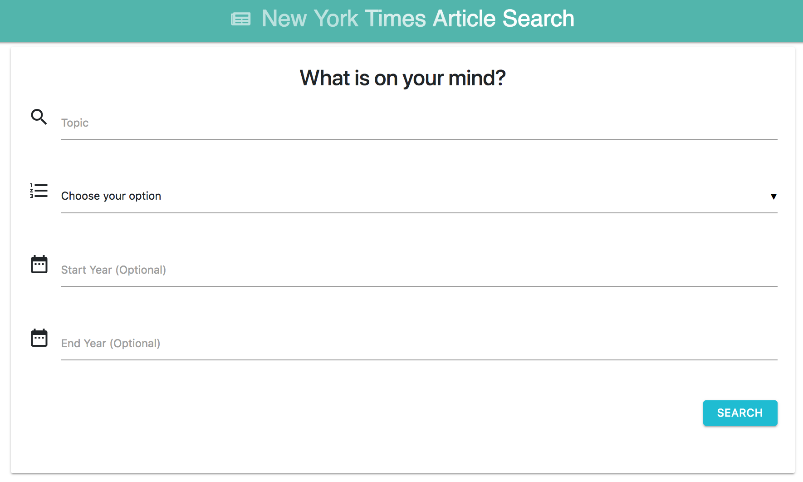

# NYT-React-Search

### React-based rendition of the New York Times Article Search application

### Technology Stack: React, HTML, CSS, Bootstrap, Materialize, JavaScript, jQuery, Node, Express and MongoDB

---

### How It Works

- Go to the app's home page at https://mynytscraper.herokuapp.com/.
- Users are able to query the New York Times based on topic and date. It displays the results in a rendered list with the article title, publication date, id, and allows the user to visit an article's url or save the article to the MongoDB.
- When users hit the "Saved" button, it renders articles that are saved in the MongoDB and allows the user to visit the article's url or delete it from the MongoDB.

---
